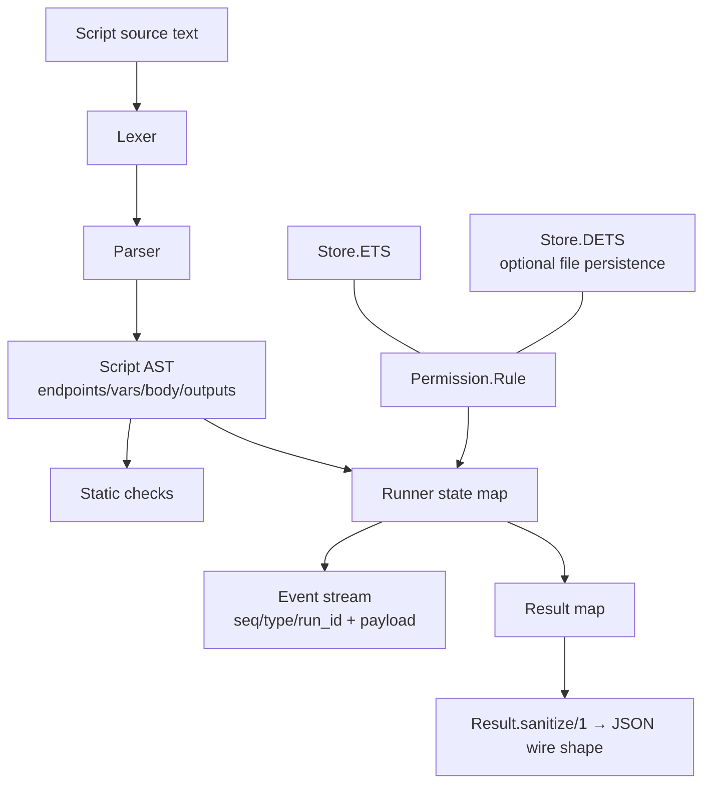

# Project Schema

Data model reference for `genai_approval`. **No relational store** — this
library's "schema" is its in-memory data shapes: the parsed script AST,
permission rules (with optional DETS persistence), the runner's state/event
stream, and the JSON result contract. Source of truth: `lib/genai/approval/`
(see [PROJ-LAYOUT.md](PROJ-LAYOUT.md) for the code map; language semantics in
[arch/script-format.md](arch/script-format.md), rule semantics in
[arch/permissions.md](arch/permissions.md)).

## Overview

## Script AST (`GenAI.Approval.Script`)

Top-level `Script` struct (parsed output):

| Field | Type | Description |
|-------|------|-------------|
| `endpoints` | `%{name => Endpoint.t}` | Preamble declarations, keyed by name |
| `vars` | `[VarDecl.t]` | Typed variable declarations, in order |
| `body` | `[Step.t \| If.t]` | Statements tree (steps + conditionals) |
| `outputs` | `[Output.t]` | Declared outputs, evaluated at run end |
| `steps` | `[Step.t]` | All steps in document order (both branch arms) |
| `source` | `String.t \| nil` | Original source |

Sub-structs:

| Struct | Fields | Notes |
|--------|--------|-------|
| `Endpoint` | `name, transport, url, auth, opts (map), line` | `auth` is `{:credential, id}` — never a secret |
| `VarDecl` | `name, type, default, nullable, has_default, line` | Types: see grammar doc |
| `Step` | `id, title, statements, attrs, calls, line, end_line` | `calls` statically extracted `{endpoint, command}` pairs |
| `Assign` | `var, expr, line` | RHS may be a `:call` expression |
| `Call` | `endpoint, command, args, line` | `args` is `[{name, expr}]` |
| `If` | `condition, then_body, else_body, negate, line, else_line, end_line` | `{{#unless}}` parses to `negate: true` |
| `Output` | `name, expr, line` | — |

Expressions are **data-only tuples**: `{:lit, term}`, `{:lit_list, [expr]}`,
`{:var, [segment,...]}`, `{:not, expr}`, `{:op, op, l, r}` (`op` ∈ `:== :!= :< :> :<= :>= :and :or`), `{:call, endpoint, command, [{name, expr}]}` (assign RHS only).

## Permission rules (`GenAI.Approval.Permission.Rule`)

| Field | Type | Description |
|-------|------|-------------|
| `id` | `String.t` | `"rule_" <> 16 hex chars` (generated) |
| `pattern` | `String.t` | `"endpoint:command"` with globs (`github:issues.*`, `*:*`) |
| `effect` | `:allow \| :block` | Block beats allow at equal specificity |
| `scope` | `:call \| :session \| {:until, DateTime.t} \| :always` | Ordering: call > session > until > always |
| `subject` | `String.t \| nil` | Rule owner/filter key |
| `session_id` | `String.t \| nil` | Session-scoped filter |
| `granted_by` | `String.t \| nil` | Who approved |
| `granted_at` | `DateTime.t \| nil` | Newer grants outrank older at full tie |
| `reason` | `String.t \| nil` | Free-text justification |

Resolution is normative (PRD §8.2): specificity (command dominates endpoint) → block-over-allow → narrower scope → newest grant; no match ⇒ `:ask` (default-deny). Expired `{:until, _}` rules never match.

### Stores

`GenAI.Approval.Permission.Store` behaviour; two backends:

| Store | Persistence | Semantics |
|-------|-------------|-----------|
| `Store.ETS` | In-memory (default) | Expired rules pruned lazily on read |
| `Store.DETS` | DETS file, `:dets.sync` per write | `:call`-scope rules **never persisted** in either store; survives restarts |

## Error codes (`GenAI.Approval.Error`)

`%Error{code, message, line, column}` — codes are **stable API**:
`script_too_large`, `too_many_steps`, `unterminated`, `unexpected_text`,
`unexpected_token`, `unknown_block`, `section_order`, `stmt_outside_step`,
`call_in_condition`, `call_in_outputs`, `undeclared_endpoint`,
`duplicate_endpoint`, `undeclared_var`, `duplicate_var`, `type_mismatch`,
`auth_literal`, `invalid_endpoint`, `unknown_type`.

## Runner state (internal map)

The runner GenServer keeps a plain map (not a struct): `run_id`, `script`,
`env`, `frontier`, `status` (`:paused \| :running \| :awaiting_permission \| :done \| …`),
`mode`, `pending`, `executors`, `results` (per-step outcomes, keyed by step id),
`edits`, `notes`, `grants`, `breakpoints` (MapSet), `overrides`, `seq`,
`events`, `budgets`, `timers`, `retried`, `result`, `halt_info`, `permission`.

### Event schema

Each event: `%{seq: pos_integer, type: atom, run_id: ref, ...payload}`.
Types include `:run_loaded`, `:paused`, `:annotated`, `:permission_granted`,
and step lifecycle events. The ring keeps the last `@event_ring` events;
`events/1` returns them oldest-first for replay.

## Result contract (JSON wire shape)

`GenAI.Approval.Result.sanitize/1` normalizes any run result to
JSON-serializable data: string keys, ISO-8601 `DateTime`/`Date`, atoms →
strings, tuples/pids/refs → inspected strings. The MCP
`submit_approval_script` tool returns this as structured content.
