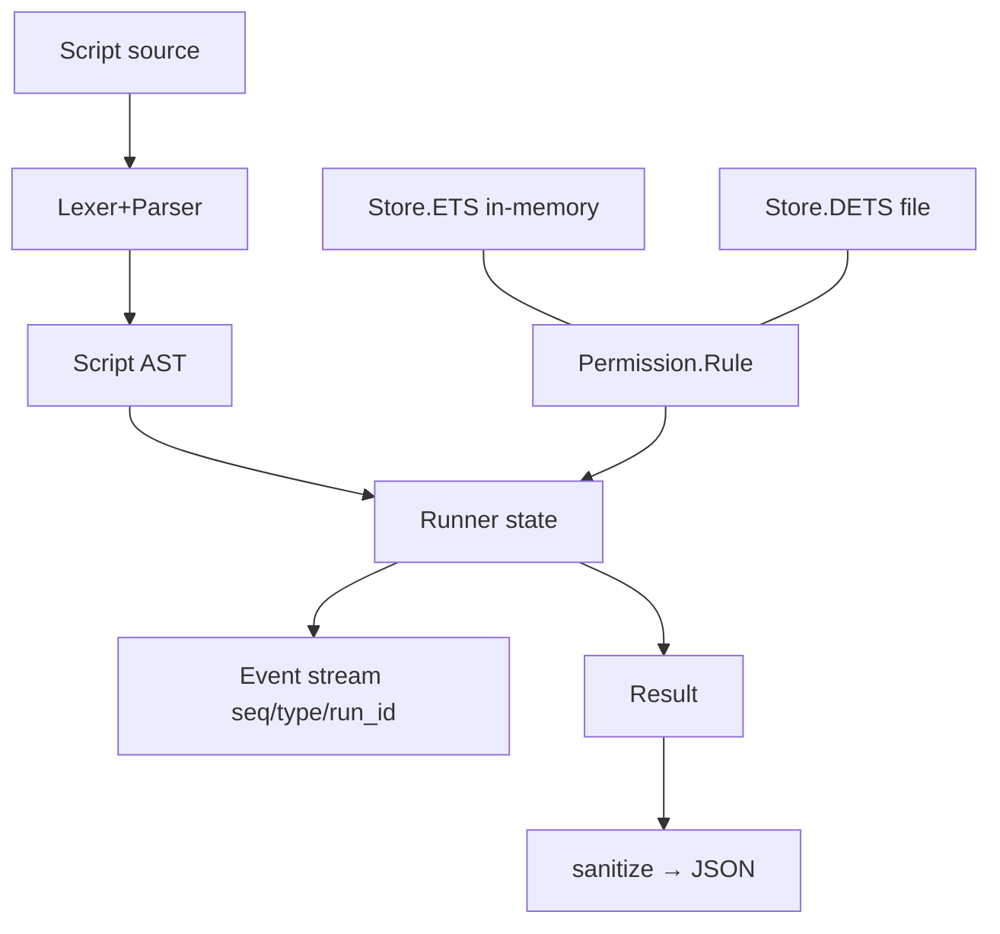

# Project Schema (summary)

Condensed companion to [PROJ-SCHEMA.md](PROJ-SCHEMA.md). No relational store —
data shapes only.

| Shape | Module | Key fields |
|-------|--------|-----------|
| Script AST | `Script` | `endpoints, vars, body, outputs, steps, source` |
| Endpoint | `Script.Endpoint` | `name, transport, url, auth (credential ref), opts` |
| VarDecl | `Script.VarDecl` | `name, type, default, nullable` |
| Step / If / Assign / Call / Output | `Script.*` | statements tree; `If.negate` for `#unless` |
| Permission rule | `Permission.Rule` | `pattern "ep:cmd" glob, effect allow/block, scope call/session/until/always` |
| Stores | `Store.ETS` / `Store.DETS` | behaviour; `:call` scope never persisted; lazy prune |
| Error | `Error` | `code (18 stable atoms), message, line, column` |
| Event | runner internal | `%{seq, type, run_id, ...payload}`, replay ring |
| Result | `Result.sanitize/1` | JSON: string keys, ISO-8601, atoms→strings |
