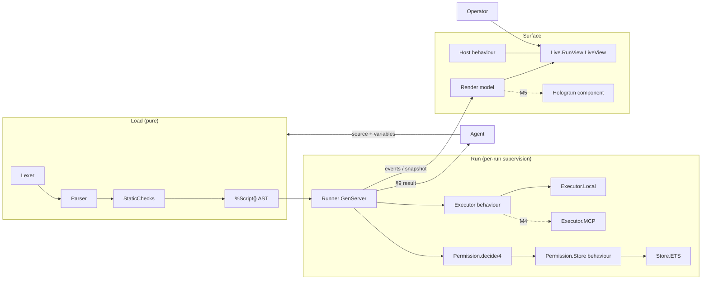

# Architecture Overview

`genai_approval` lets an agent submit a plan as a small, non-Turing-complete
**approval script** which a human then drives interactively — step / next /
run-all / edit / halt — with breakpoints and scoped allow/block permission
rules. The structured result returns to the calling agent.

Full product requirements: `project-management/PRDs/genai-interactive-approval-scripts.md`
in the Noizu master repo. This directory documents how the implementation is
put together.

## Component map

| Module | File | Responsibility |
|---|---|---|
| `GenAI.Approval` | `lib/genai/approval.ex` | Facade: `load/2`, `start_run/2`, `command/2`, `await/2`, `subscribe/2`, `snapshot/1` |
| `GenAI.Approval.Lexer` | `lib/genai/approval/lexer.ex` | Source → segments (`{:mustache, tokens}` / `{:text, ...}`) with line/col |
| `GenAI.Approval.Parser` | `lib/genai/approval/parser.ex` | Recursive-descent parse → `%Script{}`; all errors carry code + line/col |
| `GenAI.Approval.StaticChecks` | `lib/genai/approval/static_checks.ex` | Post-parse validation (R5.x); reports **all** errors |
| `GenAI.Approval.Script` | `lib/genai/approval/script.ex` | AST structs (`Endpoint`, `VarDecl`, `Step`, `Assign`, `Call`, `If`, `Output`) |
| `GenAI.Approval.Expr` | `lib/genai/approval/expr.ex` | Pure expression evaluator; call expressions via injected callback |
| `GenAI.Approval.Runner` | `lib/genai/approval/runner.ex` | The run state machine (one GenServer per run) |
| `GenAI.Approval.Executor` | `lib/genai/approval/executor.ex` | Execution-target behaviour (`prepare/execute/describe/close`) |
| `GenAI.Approval.Executor.Local` | `lib/genai/approval/executor/local.ex` | Native in-process handlers |
| `GenAI.Approval.Permission` | `lib/genai/approval/permission.ex` | Rule struct + normative resolution |
| `GenAI.Approval.Permission.Store(.ETS)` | `lib/genai/approval/permission/store*` | Pluggable rule persistence; ETS default |
| `GenAI.Approval.Render` | `lib/genai/approval/render.ex` | Shared UI model: tolerant highlighter + annotated lines + affordances |
| `GenAI.Approval.Host` | `lib/genai/approval/host.ex` | Behaviour for host apps (present / on_event / resolve_credential) |
| `GenAI.Approval.Live.RunView` | `lib/genai/approval/live/run_view.ex` | LiveView reference UI (compiled only when LiveView is present) |

## Supervision

`GenAI.Approval.Application` starts:

- `GenAI.Approval.Registry` — run-id → runner pid
- `GenAI.Approval.TaskSupervisor` — step-execution tasks (`async_nolink`)
- `GenAI.Approval.RunSupervisor` — `DynamicSupervisor` of `Runner`s (`restart: :temporary`)
- `GenAI.Approval.PermissionStore` — default named ETS rule store

Each step executes in a supervised task so control commands — halt above all —
stay responsive while a call is in flight. A crashing handler becomes a step
*failure*, never a runner crash.

## Security invariants (PRD §11)

- **No eval.** Scripts parse to data-only AST; the interpreter dispatches on
  structure, never on script-derived module/function names.
- **No atoms from input.** Idents, keys, and values stay binaries end-to-end.
- **Bounded by construction.** No loops/recursion; size and step caps at load;
  per-step timeout, run wall clock, and idle timeout at run time.
- **Secrets never in scripts.** `auth = credential("id")` references only;
  an inline auth literal is a parse error.
- **Default-deny.** No matching permission rule ⇒ ask the operator.
- **Escaped rendering.** All script/operator content is HEEx-interpolated;
  hostile titles/notes render inert (covered by tests).

## Milestone status

- **M1** ✅ grammar + engine + Local executor + permission engine
- **M2** ✅ event stream, snapshot, Render model, Host behaviour, LiveView UI
- **M3** durable/entity-backed permission store
- **M4** MCP executor (`noizu_mcp`) + `submit_approval_script` tool + elicitation fallback
- **M5** Hologram UI + `com.noizu/approval-scripts` protocol extension draft
