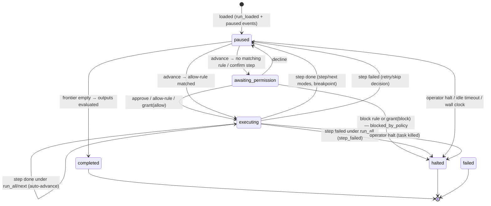

# Runner — the run state machine

One `GenAI.Approval.Runner` GenServer per run, started under
`GenAI.Approval.RunSupervisor` (`restart: :temporary`) and registered by
run id in `GenAI.Approval.Registry`.

## States

`failed` is reserved for engine-level errors (e.g. a branch condition that
cannot evaluate). Step-level errors never crash the run — they pause it
(or halt it under `run_all`).

## Commands

`GenAI.Approval.command(run, cmd)` — synchronous; invalid commands for the
current state return `{:error, ...}` without side effects.

| Command | Valid in | Effect |
|---|---|---|
| `:step` | paused | Execute exactly one step, then pause |
| `:next` | paused | Run until next breakpoint, branch entry, or confirm step |
| `:run_all` | paused | Run to completion; honors breakpoints, confirm steps, permission gates |
| `:approve` / `:decline` | awaiting_permission | One-shot approval / decline pending step |
| `{:grant, effect, scope[, pattern]}` | awaiting_permission | Write a rule (except `:call` scope) then re-gate; `scope` ∈ `:call`, `:session`, `{:for, secs}`, `{:until, dt}`, `:always` |
| `:retry` | paused, failed step | Re-execute the failed step (once per step) |
| `:skip` | paused, failed step | Skip — only if the step has `optional=true` |
| `{:edit, {:var, name}, v}` | paused / awaiting | Update a variable (recorded as a diff) |
| `{:edit, {:arg, step_id, arg}, v}` | paused / awaiting | Override a not-yet-executed step's argument |
| `{:halt, reason}` | any non-terminal | Halt, killing any in-flight step task |
| `{:set_breakpoint, id}` / `{:clear_breakpoint, id}` | any non-terminal | Toggle a breakpoint |
| `{:annotate, target, text}` | any non-terminal | Attach a note to a step id or `"run"` |

Fast-forward modes pause *before* a breakpointed step; the hit is recorded in
`bp_hits`, so resuming (any mode) runs through it. `confirm="phrase"` steps
always park in `awaiting_permission` — standing allow rules cannot pass them
(voice safety, R5.7).

## Step execution

Steps run in `Task.Supervisor.async_nolink` tasks:

- Statements execute in order; `assign` results merge into the env only on
  step success (a retried step re-runs from the step's start).
- Argument overrides from operator edits apply at call time; both
  `args_submitted` and `args_executed` are recorded per call.
- A per-step timer (`budgets.step_timeout`, default 60 s) kills the task and
  fails the step. Crashing handlers become step failures via the `DOWN`
  message.

## Budgets

| Budget | Default | On expiry |
|---|---|---|
| `step_timeout` | 60 s | Step fails, run pauses (retry/skip/halt) |
| `run_timeout` | 30 min | Halt `budget_exceeded` |
| `idle_timeout` | 15 min | Halt `operator_timeout` (only while paused/awaiting) |

The idle timer resets on every operator command.

## Events

Subscribers (`subscriber:` option and `subscribe/2`) receive
`{:genai_approval, run_id, event}` maps with a monotonic `seq`; the last 500
are kept in a replay ring (`events/1`). Types:

`run_loaded · paused · permission_required · permission_granted · blocked ·
step_started · step_completed · branch_decided · edited · annotated ·
breakpoint_set/cleared · halted · failed · completed`

Telemetry mirrors the important ones: `[:genai_approval, :run|:step, :start|:stop|:exception]`
and `[:genai_approval, :permission, :decision|:grant]` — metadata never
includes arguments, results, or secrets.

## Result contract (PRD §9, `contract: "1"`)

Returned by `await/2` and included in terminal state: per-step outcomes
(status ∈ `completed skipped failed declined not_reached`, calls with
submitted/executed args, via, duration), branch decisions, edit diffs, notes,
declared outputs (best-effort on halt; unevaluable entries listed in
`outputs_unavailable`), permission grants, halt info (`reason`, `actor`,
`at_step`).
